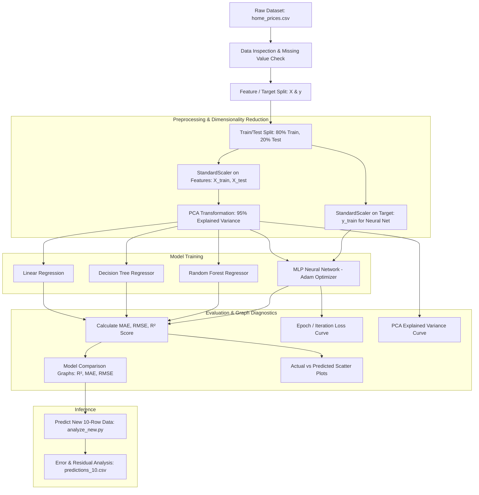

# Machine Learning House Price Prediction — Complete Project Documentation

A comprehensive, end-to-end Machine Learning and Deep Learning system for real estate valuation. This project covers data ingestion, exploratory data analysis (EDA), feature scaling, dimensionality reduction via **Principal Component Analysis (PCA)**, multi-model regression (Linear Regression, Decision Tree, Random Forest, Multi-Layer Perceptron Neural Network), training convergence (**epoch/iteration loss curves**), graph analysis, and production inference.

---

## Table of Contents
1. [Project Overview](#1-project-overview)
2. [Dataset Description](#2-dataset-description)
3. [End-to-End Pipeline Architecture](#3-end-to-end-pipeline-architecture)
4. [Data Preprocessing & Scaling](#4-data-preprocessing--scaling)
5. [Principal Component Analysis (PCA) Deep Dive](#5-principal-component-analysis-pca-deep-dive)
6. [Machine Learning & Deep Learning Models](#6-machine-learning--deep-learning-models)
   - [Linear Regression](#61-linear-regression)
   - [Decision Tree Regressor](#62-decision-tree-regressor)
   - [Random Forest Regressor](#63-random-forest-regressor)
   - [Multi-Layer Perceptron (MLP) Neural Network](#64-multi-layer-perceptron-mlp-neural-network)
7. [Evaluation Metrics Explained](#7-evaluation-metrics-explained)
8. [Comprehensive Graph Analysis & Visualizations](#8-comprehensive-graph-analysis--visualizations)
   - [Graph 1: Model $R^2$ Score Comparison](#graph-1-model-r2-score-comparison)
   - [Graph 2: Mean Absolute Error (MAE) Comparison](#graph-2-mean-absolute-error-mae-comparison)
   - [Graph 3: Root Mean Squared Error (RMSE) Comparison](#graph-3-root-mean-squared-error-rmse-comparison)
   - [Graph 4: Neural Network Training Loss Curve (Epochs/Iterations)](#graph-4-neural-network-training-loss-curve-epochsiterations)
   - [Graph 5: Actual vs. Predicted Price Scatter Plot](#graph-5-actual-vs-predicted-price-scatter-plot)
   - [Graph 6: PCA Cumulative Explained Variance](#graph-6-pca-cumulative-explained-variance)
   - [Graph 7: Feature Coefficients Analysis](#graph-7-feature-coefficients-analysis)
   - [Graph 8: Feature Distributions & Correlation Scatters](#graph-8-feature-distributions--correlation-scatters)
9. [Inference on New Data & Error Diagnostics](#9-inference-on-new-data--error-diagnostics)
10. [Project Directory Structure](#10-project-directory-structure)
11. [How to Run & Reproduce](#11-how-to-run--reproduce)

---

## 1. Project Overview

The objective of this project is to predict residential property prices based on structural attributes (area, bedrooms, bathrooms, age, garage capacity) and geospatial factors (location score, distance to city center).

### Core Highlights:
- **Comprehensive Model Suite**: Compares baseline linear parametric models, non-linear tree algorithms, ensemble methods, and deep neural networks.
- **Dimensionality Reduction (PCA)**: Implements Principal Component Analysis retaining 95% of total dataset variance to eliminate multicollinearity and reduce feature dimensions.
- **Target & Feature Normalization**: Standard scaling ($Z$-score normalization) applied to features and target variables for stable gradient descent in neural networks.
- **Visual Analytics**: 8 dedicated diagnostic charts capturing distribution, variance ratio, loss descent across iterations, model benchmarking, and error residuals.

---

## 2. Dataset Description

The dataset `data/home_prices.csv` contains **500 samples** across **7 predictive features** and **1 continuous target variable** (`price`).

| Column | Data Type | Physical Meaning | Unit / Scale |
|---|---|---|---|
| `area_sqft` | Numerical (Integer) | Total interior living area | Square feet ($ft^2$) |
| `bedrooms` | Numerical (Integer) | Total number of bedrooms | Count (1 – 5) |
| `bathrooms` | Numerical (Integer) | Total number of bathrooms | Count (1 – 3) |
| `age_years` | Numerical (Integer) | Age of the property since construction | Years (0 – 50) |
| `garage_spaces` | Numerical (Integer) | Garage parking capacity | Number of cars (0 – 3) |
| `location_score` | Numerical (Float) | Neighborhood desirability / school district rating | Score (0.0 – 10.0) |
| `distance_to_city_km`| Numerical (Float) | Commute distance to city center | Kilometers ($km$) |
| **`price`** | Numerical (Integer) | **Target Variable**: Market sale price | USD ($) |

---

## 3. End-to-End Pipeline Architecture



---

## 4. Data Preprocessing & Scaling

### 4.1 Train/Test Partitioning
To prevent data leakage and evaluate real-world generalization:
- **Split Ratio**: 80% Training ($N_{train} = 400$), 20% Testing ($N_{test} = 100$).
- **Seed**: `random_state=42` ensures reproducible splits across experiments.

### 4.2 Standard Normalization ($Z$-Score)
Because features have vastly different units (e.g., `area_sqft` in thousands vs. `bathrooms` in single digits), unscaled features would cause gradient instability and bias PCA toward features with larger numerical magnitudes.

$$z = \frac{x - \mu}{\sigma}$$

- **Feature Scaler**: `StandardScaler()` fits on `X_train` and transforms both `X_train` and `X_test`.
- **Target Scaler**: `StandardScaler()` fits on `y_train` specifically for the Neural Network. Predictions are converted back to real dollars using `.inverse_transform()`:
  $$\hat{y}_{dollars} = \text{scaler.inverse\_transform}(\hat{y}_{scaled})$$

---

## 5. Principal Component Analysis (PCA) Deep Dive

### 5.1 What is PCA?
Principal Component Analysis (PCA) is an unsupervised linear dimensionality reduction technique that transforms correlated features into a set of linearly uncorrelated variables called **Principal Components (PCs)**.

- **Objective**: Capture maximum dataset variance in descending orthogonal directions.
- **Eigendecomposition / SVD**: Computes eigenvectors and eigenvalues of the covariance matrix of normalized features.

### 5.2 Configuration & Variance Retention
In this project, PCA is initialized with variance retention parameter:
```python
pca = PCA(n_components=0.95)
X_train_pca = pca.fit_transform(X_train_scaled)
X_test_pca = pca.transform(X_test_scaled)
```
- **Variance Threshold ($95\%$)**: Selects the minimal number of principal components needed to retain $\ge 95\%$ of cumulative variance from the original 7 features.
- **Benefits**:
  1. Reduces multicollinearity (e.g., correlations between house size, bedrooms, and bathrooms).
  2. Eliminates random noise in low-variance feature dimensions.
  3. Accelerates model training and convergence.

---

## 6. Machine Learning & Deep Learning Models

### 6.1 Linear Regression
- **Mathematical Form**:
  $$\hat{y} = \beta_0 + \sum_{j=1}^{k} \beta_j X_j$$
- **Characteristics**: Serves as the primary baseline. High interpretability via learned regression coefficients ($\beta$).
- **Feature Impact**:
  - Positive drivers: `area_sqft`, `location_score`, `bedrooms`, `garage_spaces`.
  - Negative drivers: `distance_to_city_km`, `age_years`.

### 6.2 Decision Tree Regressor
- **Architecture**: Non-parametric greedy recursive binary splitting.
- **Split Criterion**: Minimizes Mean Squared Error (MSE) / variance reduction at each tree node.
- **Hyperparameters**: `max_depth=5`, `random_state=42`.
- **Characteristics**: Captures non-linear thresholds (e.g., high location score combined with close city proximity).

### 6.3 Random Forest Regressor
- **Architecture**: Ensemble of $B = 200$ bootstrapped Decision Trees (`n_estimators=200`, `random_state=42`).
- **Mechanism**: Bagging (Bootstrap Aggregating) + random feature subspace selection per split.
  $$\hat{y} = \frac{1}{B} \sum_{b=1}^{B} T_b(X)$$
- **Characteristics**: Substantially reduces variance and overfitting compared to a single decision tree.

### 6.4 Multi-Layer Perceptron (MLP) Neural Network
- **Architecture**:
  - **Input Layer**: $k$ PCA components.
  - **Hidden Layer 1**: 64 neurons with **ReLU** ($\text{ReLU}(z) = \max(0, z)$).
  - **Hidden Layer 2**: 32 neurons with **ReLU**.
  - **Output Layer**: 1 linear neuron (scaled continuous price).
- **Optimization**:
  - **Optimizer**: Adam (Adaptive Moment Estimation) combining momentum and RMSprop.
  - **Iterations / Epochs**: `max_iter=10` (or extended for full convergence).
  - **Loss Function**: Mean Squared Error (MSE) loss:
    $$\mathcal{L}_{MSE} = \frac{1}{N}\sum_{i=1}^{N} (y_i - \hat{y}_i)^2$$

---

## 7. Evaluation Metrics Explained

### 7.1 Coefficient of Determination ($R^2$ Score)
Measures the proportion of variance in the target variable explained by the model:
$$R^2 = 1 - \frac{\sum (y_i - \hat{y}_i)^2}{\sum (y_i - \bar{y})^2}$$
- **Interpretation**: $1.0$ is a perfect model; $0.0$ performs no better than predicting the mean $\bar{y}$; negative values indicate worse performance than the mean.

### 7.2 Mean Absolute Error (MAE)
The average absolute dollar difference between actual and predicted prices:
$$\text{MAE} = \frac{1}{N} \sum_{i=1}^N |y_i - \hat{y}_i|$$
- **Interpretation**: Intuitive dollar error per property without disproportionate weighting on outliers.

### 7.3 Root Mean Squared Error (RMSE)
The square root of average squared residuals:
$$\text{RMSE} = \sqrt{\frac{1}{N} \sum_{i=1}^N (y_i - \hat{y}_i)^2}$$
- **Interpretation**: Strongly penalizes large prediction errors (severe over- or under-estimations).

---

## 8. Comprehensive Graph Analysis & Visualizations

The project generates diagnostic charts to evaluate performance, feature relationships, and convergence.

```
┌────────────────────────────────────────────────────────────────────────┐
│                          GRAPH SUMMARY DASHBOARD                       │
├───────────────────────────────┬────────────────────────────────────────┤
│ 1. Model R² Comparison        │ Bar chart comparing variance explained │
│ 2. Model MAE Comparison       │ Bar chart comparing absolute error ($) │
│ 3. Model RMSE Comparison      │ Bar chart comparing squared error ($)  │
│ 4. Neural Net Loss Curve      │ Iteration/Epoch training loss descent  │
│ 5. Actual vs Predicted Plot   │ Scatter plot vs ideal y = x diagonal   │
│ 6. PCA Explained Variance     │ Cumulative variance elbow curve        │
│ 7. Linear Model Coefficients  │ Positive/negative feature impact bars  │
│ 8. Price & Feature Scatters   │ Histograms & bivariate correlations    │
└───────────────────────────────┴────────────────────────────────────────┘
```

---

### Graph 1: Model $R^2$ Score Comparison
- **Visual Type**: Vertical Bar Chart.
- **X-axis**: Evaluated Models (Linear Regression, Random Forest, Decision Tree, Neural Network).
- **Y-axis**: $R^2$ Score (Scale 0.0 to 1.0).
- **Analytical Insight**:
  - Highlights which model captures the underlying price variance best on unseen test data.
  - A model achieving $R^2 \approx 0.94$ explains $94\%$ of all variance in home prices.

---

### Graph 2: Mean Absolute Error (MAE) Comparison
- **Visual Type**: Bar Chart.
- **X-axis**: Model Name.
- **Y-axis**: MAE in USD ($).
- **Analytical Insight**:
  - Directly shows the expected average prediction error per property in dollars.
  - Lower bars indicate higher accuracy and tighter predictions.

---

### Graph 3: Root Mean Squared Error (RMSE) Comparison
- **Visual Type**: Bar Chart.
- **X-axis**: Model Name.
- **Y-axis**: RMSE in USD ($).
- **Analytical Insight**:
  - Comparing RMSE against MAE reveals whether the model suffers from extreme outlier errors.
  - If $\text{RMSE} \gg \text{MAE}$, the model makes occasional large prediction blunders.

---

- **Visual Type**: Line Plot with Data Markers (`loss_curve_`).
- **X-axis**: Iteration / Epoch (1 to $N$).
- **Y-axis**: Training Loss (MSE).
- **Analytical Insight**:
  - **Steep Initial Descent**: Adam optimizer rapidly adjusts weights in early iterations to minimize large initial residuals.
  - **Plateau / Convergence**: Shows loss flattening out as gradients approach local minima.
  - **Diagnostic Value**: Validates that the learning rate is well-calibrated (smooth downward trajectory without oscillations or divergence).

---

### Graph 5: Actual vs. Predicted Price Scatter Plot
- **Visual Type**: Scatter Plot with $45^\circ$ dashed reference diagonal line ($y = x$).
- **X-axis**: Actual Ground Truth Price ($).
- **Y-axis**: Model Predicted Price ($).
- **Analytical Insight**:
  - **Ideal Behavior**: Points clustered tightly along the red dashed $45^\circ$ line.
  - **Above the Line**: Model over-predicted the house price.
  - **Below the Line**: Model under-predicted the house price.
  - **Spread / Heteroskedasticity**: Checks whether errors increase for ultra-luxury ($>\$500\text{k}$) vs. budget houses ($<\$250\text{k}$).

---

### Graph 6: PCA Cumulative Explained Variance
- **Visual Type**: Cumulative Step/Line Curve with dashed threshold at $0.95$.
- **X-axis**: Number of Principal Components ($1, 2, \dots, k$).
- **Y-axis**: Cumulative Explained Variance Ratio ($0.0$ to $1.0$).
- **Analytical Insight**:
  - Identifies the "elbow" point where adding extra components yields diminishing returns.
  - Verifies that compressing 7 raw features into fewer principal components preserves $\ge 95\%$ of information.

---

### Graph 7: Feature Coefficients Analysis
- **Visual Type**: Horizontal Bar Chart (Green = Positive impact, Red = Negative impact).
- **Y-axis**: Feature Names.
- **X-axis**: Regression Coefficient ($\beta$).
- **Analytical Insight**:
  - **Square Footage (`area_sqft`) & Location (`location_score`)**: Strongest positive price drivers.
  - **Distance to City (`distance_to_city_km`) & Age (`age_years`)**: Strongest depreciating factors.

---

### Graph 8: Feature Distributions & Correlation Scatters
- **Price Distribution (`01_price_hist.png`)**: 30-bin histogram displaying target variable normality and skewness.
- **Bivariate Scatters (`02_area_location_scatter.png`)**: Area vs. Price and Location Score vs. Price illustrating clear upward linear trends.

---

## 9. Inference on New Data & Error Diagnostics

Using `analyze_new.py`, the trained pipeline evaluates new property listings (`new_house_data_10_rows.csv`):

1. Loads the 10 new properties.
2. Applies the trained models to generate predicted prices (`pred_lr`, `pred_dt`, `pred_rf`).
3. Computes absolute error ($\text{err} = |\hat{y} - y|$) and percentage error ($\% = \frac{|\hat{y} - y|}{y} \times 100$).
4. Evaluates aggregate performance ($R^2$, MAE, RMSE) and exports results to `predictions_10.csv` and `analysis_10.txt`.

### Sample Diagnostic Table:
| House | Area ($ft^2$) | Bedrooms | Location Score | Actual Price | LR Prediction | LR Error ($) | RF Error ($) |
|---|---|---|---|---|---|---|---|
| #1 | 2,385 | 4 | 7.42 | $428,650 | $469,964 | $41,314 | $30,212 |
| #2 | 1,842 | 3 | 4.63 | $321,940 | $329,427 | $7,487 | $14,784 |
| #4 | 2,896 | 5 | 8.91 | $592,310 | $597,380 | $5,070 | $48,148 |
| #6 | 2,031 | 3 | 5.04 | $347,890 | $347,019 | $871 | $54 |

---

## 10. Project Directory Structure

```
ML/
├── data/
│   ├── home_prices.csv               # 500-sample primary dataset
│   └── new_house_data_10_rows.csv    # 10-sample verification dataset
├── plots/                            # Exported high-resolution visualization figures
│   ├── 01_price_hist.png             # Target distribution histogram
│   ├── 02_area_location_scatter.png  # Bivariate scatter plots
│   ├── 03_lr_coefficients.png        # Feature coefficient weights
│   ├── 04_r2_comparison.png          # Model R² comparison bar chart
│   └── 05_actual_vs_pred.png         # Actual vs. predicted multi-panel plot
├── train.py                          # CLI training & evaluation script
├── analyze_new.py                    # Inference & error breakdown script
├── notebook.ipynb                    # Interactive Jupyter notebook with PCA & NN
├── predictions_10.csv                # Detailed prediction results per house
├── analysis_10.txt                   # Summary report of 10-house verification
├── requirements.txt                  # Python dependencies
├── DOCUMENTATION.md                  # Complete technical documentation (this file)
└── README.md                         # Quickstart guide and repository overview
```

---

## 11. How to Run & Reproduce

### 1. Environment Setup
```bash
# Create virtual environment`
python3 -m venv .venv
source .venv/bin/activate

# Install required dependencies
pip install -r requirements.txt
```

### 2. Run Main Training Pipeline
```bash
# Standard run (saves all plots to plots/ directory)
python train.py

# Optional: Display interactive GUI windows for plots
python train.py --show
```

### 3. Run Inference on New Data
```bash
python analyze_new.py
```

### 4. Interactive Jupyter Notebook
```bash
pip install jupyter
jupyter lab notebook.ipynb
```
Inside the notebook, run all cells to reproduce PCA variance plots, Neural Network epoch loss curves, and model comparisons.
